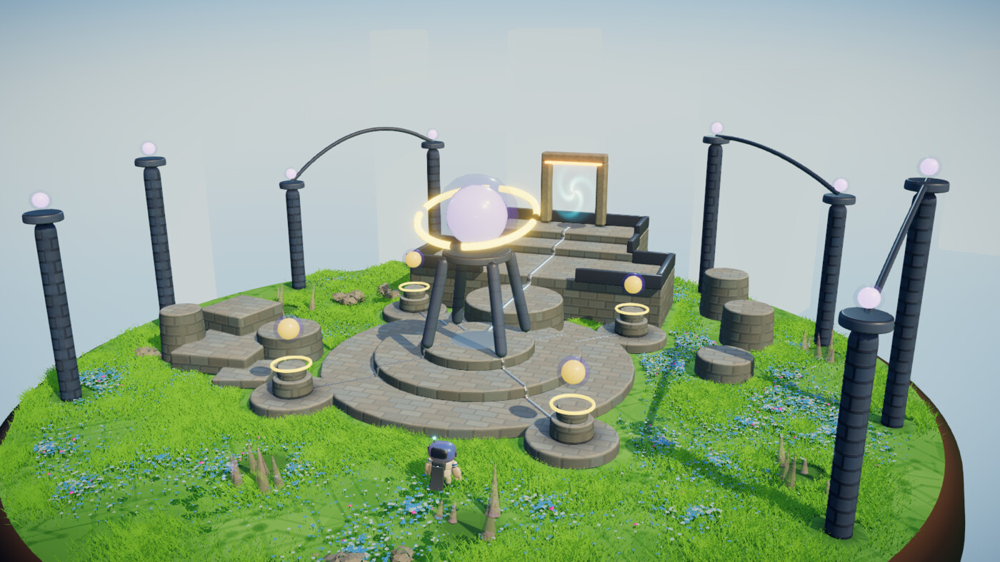
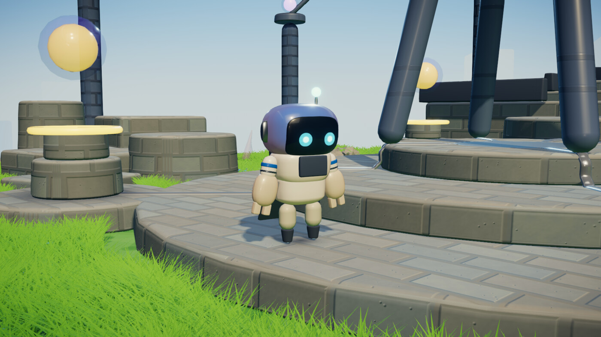
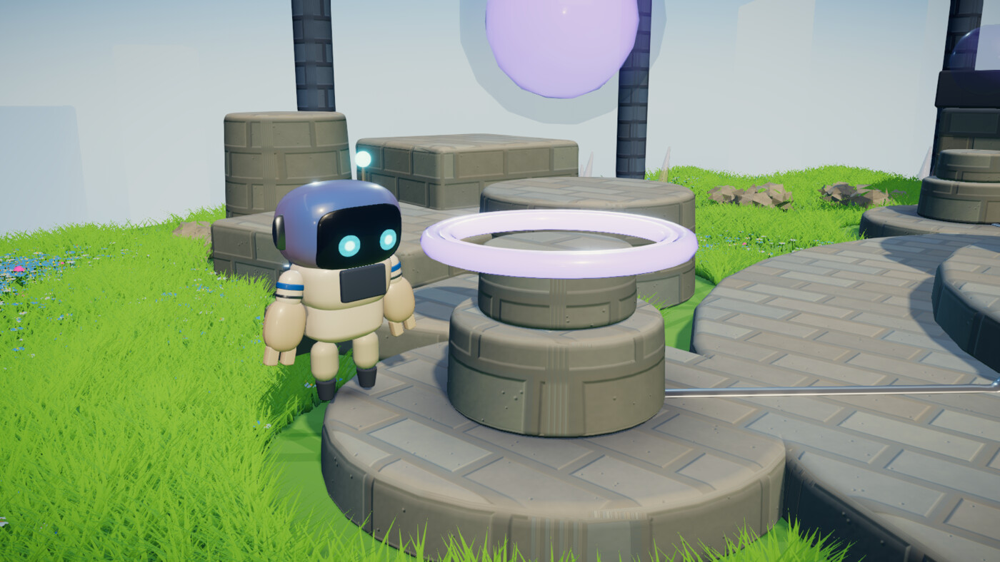
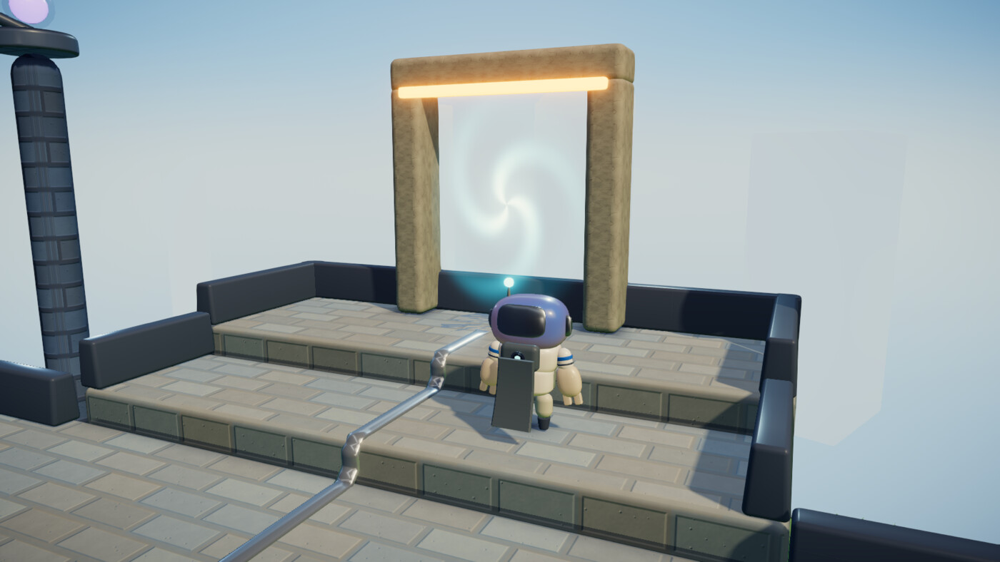
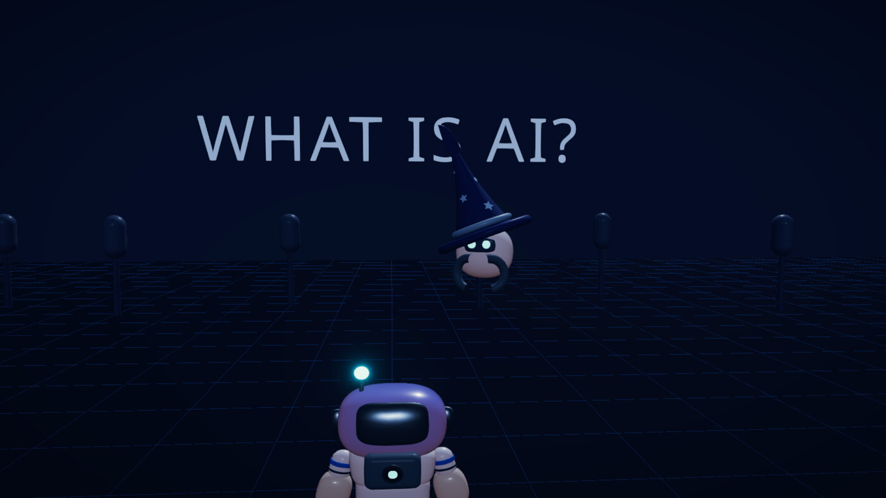
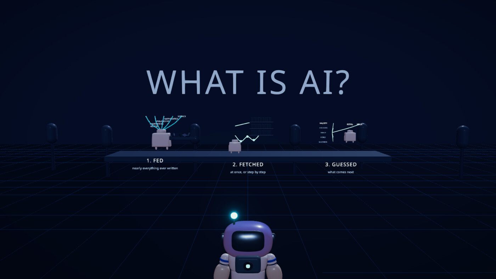
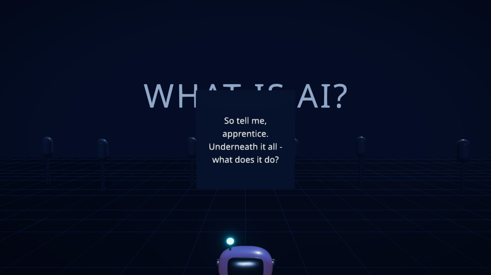
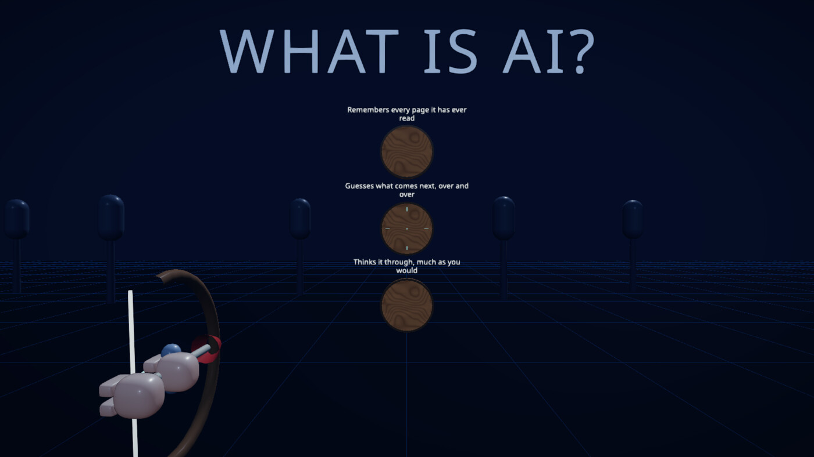
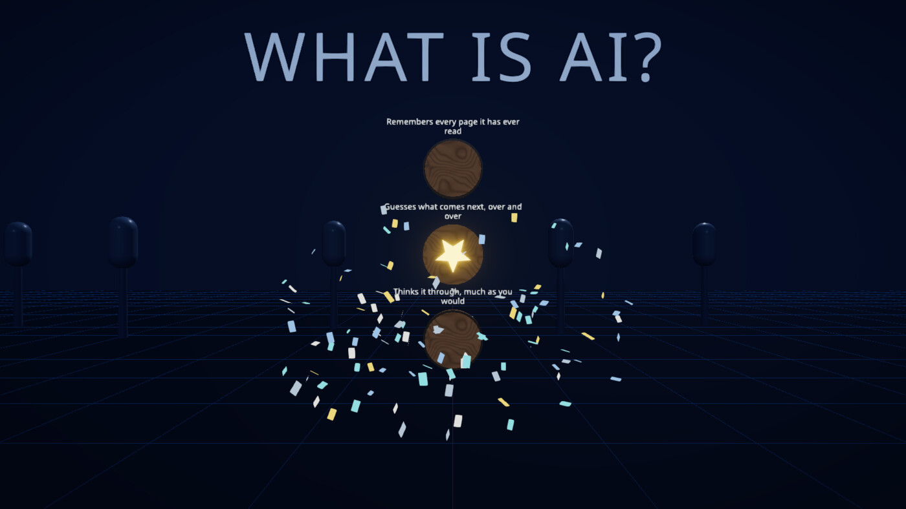

# 🤖 Agent Atlas

A browser-based course that teaches AI from zero, delivered as a walkable 3D world rather than a page of text.

**The goal is to make learning about AI user-friendly and genuinely fun, by turning it into a game you play instead of a document you skim.**
Nobody finishes the wall of text.
Everybody will fire an arrow at the answer they think is right. 🏹

Every idea in the course is meant to become something you can walk up to, look at, and act on.
You are not told that a language model guesses what comes next.
A wizard acts it out for you, and then asks you to prove you were paying attention.



---

## 🌍 The starting world: The Foundry

You wake up on a floating island with grass, flowers, and a stone ziggurat in the middle of it. 🏝️

At the centre is the Core: a glowing node held up on four struts, ringed once for every lesson you have finished.
Around it sit the lesson totems, one to a spur.
Walk up to one, press `E`, and it either marks the lesson done or drops you into the round that teaches it.

Behind the Core, a stack of stepped decks climbs to a portal at the north rim, which leads to The Prompt Cave.
The stone pylons around the edge are deliberately open to the south and the north, so the island frames the two things worth looking at: the way in, and the way on.

Falling off the edge kills you, and dying is cheap. 💀

| | |
| --- | --- |
|  |  |
| Your robot. Tank controls, variable-height jump, and a second jump on the foot thrusters. | A lesson totem. Stand in the ring, press `E`, and the lesson begins. |



The portal at the north rim.
Arriving through one and dying are the same event on screen: the picture closes to a circle centred on the robot, and reopens as it drops back into the world.

---

## 🧙 The training world: What is AI?

Pressing `E` at the first totem teleports you somewhere with no grass at all: a flat digital void with a grid floor, a lit horizon, and the question you came to answer standing over it in three-dimensional letters.

The round is a scripted nine beats, and you have no controls until it wants them.
A wizard flies in, introduces itself, and gets out of the way.
The voice is a wizard on purpose: an explanation that admits to being a performance is allowed to be blunter than one pretending to be a textbook.



Then the diorama rises, and each reading card gets acted out rather than printed.
Card one is three little stations: what the machine was **fed**, what it can **fetch**, and the one trick underneath, which is that it **guesses** what comes next.



When the reading is done, a cube descends with the question on its face.



And then you answer it with a bow. 🎯

Three planks, three answers, unlimited tries, and no way to fail.
A wrong plank flips over to a no-sign with your arrow stuck in it and flips back.



The right one turns up a gold star and the stage throws confetti at you. 🎉



The win is recorded against the lesson with how many arrows it took, and you land back on the island beside the totem that sent you.
You can walk straight back in and play it again.

---

## 🎮 Controls

| Input | Action |
| --- | --- |
| W/S or up/down arrows | Drive forward and back, along the way the robot is facing |
| A/D or left/right arrows | Turn on the spot, continuously and in either direction |
| Space | Jump, with variable height. Press it again in the air for a second jump on the thrusters |
| Mouse drag, or two-finger scroll | Orbit the camera |
| E or Enter | Interact with the totem you are standing at |
| 🕹️ Gamepad | Left stick drives and turns, A jumps, X interacts, right stick orbits |

Inside a lesson round, where the robot is locked and the camera is directed for you:

| Input | Action |
| --- | --- |
| Right arrow, Enter, or the Next button | Turn the page |
| Mouse | Aim the bow |
| Click | Loose an arrow |
| Esc | Leave the round and go back to the island |

Movement is tank-style rather than camera-relative: the robot drives along its own facing, and the camera has no say in which way that is.
Turning and driving are independent axes, so holding forward and a turn together gives full speed *and* full turn rate, and the robot arcs at a radius of `maxSpeed / turnRate`.
Neither input taxes the other, which is the property `inputAxes.ts` exists to protect.

The camera swings back behind the direction you are travelling on its own, and it arrives rather than trailing.
Dragging always wins while you are dragging, and auto-alignment resumes the moment you move again, with no cooldown in between.

Graphics quality is guessed from your GPU on first load and can be changed in the top right, or forced with `?quality=low|medium|high`.

---

## 🚀 Running it

```bash
npm install
npm run dev        # http://localhost:5173
npm run test       # progression rules, movement feel, and the round's phase machine
npm run lint
npm run typecheck
npm run build      # static output in dist/, deployable to any static host
```

There is no backend and no accounts. 🗄️
All progress lives in browser local storage under `agent-atlas-progress`.
Saves written under the old `ai-academy-progress` key are copied across once on first load.

---

## 🗺️ Where things are

- `src/game/player/tuning.ts` is the file to open when adjusting how the game feels.
  Every movement, jump, camera, and transition constant lives there so the play-adjust-play loop stays fast.
- `src/game/player/movement.ts` holds the feel logic as pure functions, unit tested in `movement.test.ts`.
  Coyote time, jump buffering, the second jump, and variable jump height are verified there rather than by eye.
- `src/art/palette.ts` and `src/art/materials.ts` define the toy-plastic look.
  Lighting is per scene in `src/art/Lighting.tsx`.
- `src/game/scenes/registry.ts` maps scene ids to lazily loaded components, named spawn points, sky colours, camera scale, and each scene's kill plane.
  Adding a zone means adding an entry here and a scene component.
- `src/state/lessons.ts` and `src/state/progression.ts` hold the progression rules, and `src/state/lessonRoutes.ts` decides what pressing `E` at a totem actually does.
- `src/game/training/` is the What is AI? round.
  `trainingMachine.ts` is its phase machine as a pure function, `cards.ts` is every word it says, and `TrainingScene.tsx` wires the two to the stage.
- `src/art/quality.ts` holds the three tiers and the pure function that guesses one from the GPU string.
  Anything expensive in the renderer reads from there rather than deciding for itself.
- `src/art/textures.ts` owns ground surfacing and the tiling density each caller asks for.
- `src/art/Grass.tsx` is the instanced grass field, and `Scatter.tsx` the rocks, pebbles and flowers around it.
- `src/game/scenes/SceneHost.tsx` is the phase machine behind travel and death.
  `irisHandle.ts` and `IrisTracker.tsx` are what keep the transition circle centred on the robot.
- `tools/critique/` is the screenshot and measurement harness the art was tuned against.
  Read its README before using any of it.

---

## 🧱 Constraints worth knowing before changing things

**Bloom runs before tone mapping**, so it sees raw HDR values.
Light intensities in `Lighting.tsx` are budgeted to keep lit diffuse surfaces below the bloom threshold in `PostFX.tsx`.
Raising a light without checking that threshold makes the entire world glow rather than just the emissives.

**Scenes are discrete and only one is mounted at a time.**
Player progress survives a scene swap because it lives in the zustand store; anything held in scene components does not.
This is what keeps zones decoupled, so adding a zone later cannot regress an existing one.

**A lesson round is a script, and a screenshot cannot check it.**
`__dev.capture()` renders correct frames with the physics stopped, so there is no picture that can tell you whether the wizard flew off on the right beat.
That is why `trainingMachine.ts` is a pure function with its own tests, and why `window.__training.seek()` exists to put the round where you want it before you photograph it.

**Three libraries have sharp edges that this project has already been cut on, and none of them failed loudly.**

drei's `SoftShadows` patches three's shadow shader chunk, and three 0.185 reworked those internals.
The result is not an error, it is the entire scene rendering flat white.
Soft shadows come from variance shadow maps selected on the renderer in `App.tsx` instead.
The same release deprecated `PCFSoftShadowMap`, which is the console warning that gives this away.

drei's `Cloud` must be inside a `Clouds` parent, which provides the context that batches it.
A bare `Cloud` does not render on its own.

drei's `Sky` scales its geometry by its `distance` prop, and the usual value is in the thousands, matching three's own example where the camera far plane is in the millions.
Ours is 250.
It was replaced by a palette-driven gradient dome in `src/art/SkyDome.tsx`, which is also the better call for a world whose whole look is a chosen palette.

**Ground textures ship as three files per set, not five.**
Colour, a normal map, and an ORM pack with ambient occlusion in red and roughness in green.
That packing is the glTF convention and it is load-bearing rather than a saving: three reads occlusion from a texture's red channel and roughness from its green, so one image fills two material slots.
Occlusion also has to be pinned to UV channel 0 in `textures.ts`, because it otherwise defaults to a second UV set that none of this geometry has, and then silently samples nothing.

**Stone has its albedo levelled at load, and the level is easy to get wrong.**
A colour map multiplies the material colour, so a dark photograph cannot tint a surface, it can only dim it: the rock averages around RGB(79,76,69), and used raw it made every stone surface render near black regardless of the colour it was given.
Levelling re-centres it so the palette drives colour and the photograph only supplies grain.
It has to leave headroom above the new mean, though, or the bright half of the rock clips and the stone comes out looking like flat plastic with dark speckles.

---

## ➕ Adding a lesson

A lesson's completion is a predicate over saved progress rather than a stored boolean:

```ts
type Lesson = {
  id: string
  zoneId: string
  title: string
  isComplete: (state: ProgressState) => boolean
}
```

Four of the five lessons still use a manual completion flag.
The fifth, `what-is-ai`, is listed in `MINIGAMES` in `lessonRoutes.ts`, which is what makes its totem launch a round instead of ticking a box.
A lesson becomes playable by being listed there, and the round records its own completion when you win.

When the approach to verifying real LLM use is chosen, it becomes one predicate implementation and nothing else changes.

Note that embedding ChatGPT, Claude, or Gemini in an iframe is not possible.
All three send `X-Frame-Options` headers that make the browser refuse to render them in a frame, so any verification approach has to work another way.

---

## 🔎 Debugging

- `?quality=low|medium|high` forces a graphics tier. `low` turns off ambient occlusion and soft shadows and cuts grass to a ring around the player, which makes it the fastest way to tell a rendering bug from a performance one.
- `?nofx` disables post-processing. Between it and `?quality=low`, most "the world looks wrong" reports can be bisected in two reloads.
- `?nogfx=rim,dof,lut,vfx,blob,face` forces individual rendering systems off, whatever the tier says.
  It is applied to the quality settings themselves rather than plumbed through props, so it reaches anything that reads its gate from the tier.
- `?threshold=<n>` overrides the bloom threshold, and `?bloomdebug` sets bloom to intensity 6 with no smoothing so the threshold becomes a hard binary mask.
  Together they are how the shipped threshold gets measured rather than guessed: sweep the threshold at a fixed camera and record the lowest value at which no non-emissive surface glows.
  The case that decides it is white plastic at a grazing angle against the sky, because that is where clearcoat Fresnel peaks.
- In dev, `window.__player` exposes live position, velocity, grounded state, the coyote and buffer timers, and both camera angles.
  `camYaw - inputYaw` is how far the camera has swung on its own since the player last let go, which is the number to look at if auto-alignment ever misbehaves again.
- In dev, `window.__training.seek(phase, patch)` jumps the lesson round straight to a beat, and `window.__training.state` reads back where it is.
  The round runs identically whether or not anything is looking at it.

A note on debugging this in a background tab: Chrome defers image decode and stops firing `requestAnimationFrame` when a window is occluded, so the loader sits at 0% and the opening iris never plays.
The game is fine; it is waiting for a frame that will not arrive until the window is genuinely visible.
